> **First:** Read `CLAUDE.md` (project instructions) — you are a **worker**.

# Task: Document and Assess Unidirectional Push Mode (#438)

## Issue
https://github.com/scanopy/scanopy/issues/438

## Problem
User in DMZ wants truly unidirectional push mode where the daemon NEVER initiates connections to the server. Current push mode still requires daemon→server connections for:
- Startup announcement
- Registration
- Heartbeat

User's DMZ firewall only permits responses to established internal connections.

## Requirements

### 1. Document Current Architecture
Create a Mermaid sequence diagram showing the complete daemon lifecycle:

```mermaid
sequenceDiagram
    participant D as Daemon
    participant S as Server

    Note over D,S: Startup Phase
    D->>S: POST /api/daemons/{id}/startup
    ...etc
```

Document ALL connection directions for:
- Startup sequence
- Registration flow
- Push mode heartbeat loop
- Pull mode work request loop
- Discovery initiation (push vs pull)
- Discovery updates during scan

### 2. Identify Every Daemon→Server Connection
Create a table:

| Phase | Endpoint | Direction | Mode | Required? |
|-------|----------|-----------|------|-----------|
| Startup | /api/daemons/{id}/startup | D→S | Both | ? |
| ... | ... | ... | ... | ... |

### 3. Assess Feasibility of True Unidirectional Push
Can push mode be modified so daemon NEVER initiates?

Consider:
- How would server know daemon exists without registration?
- How would server know daemon is alive without heartbeat?
- Pre-provisioning daemon credentials before startup?
- Server-initiated health polling instead of daemon heartbeat?

### 4. Propose Solution
Based on assessment:

**If feasible with reasonable scope:**
- Document required changes
- Estimate complexity
- Proceed to implementation if straightforward

**If significant architectural change:**
- Document the design proposal
- List all changes needed
- Identify risks and tradeoffs
- Stop for review

## Files Involved
- `backend/src/bin/daemon.rs` - Main daemon entry, mode branching (lines 23-194)
- `backend/src/daemon/shared/config.rs` - DaemonMode definition
- `backend/src/daemon/runtime/service.rs` - Heartbeat, work request, registration logic
- `backend/src/daemon/shared/api_client.rs` - HTTP client for daemon→server calls
- `backend/src/server/daemons/handlers.rs` - Server endpoints receiving daemon calls
- `backend/src/server/daemons/service.rs` - Server→daemon discovery initiation
- `backend/src/server/discovery/service.rs` - Session management

## Acceptance Criteria
- [ ] Mermaid diagram documenting full daemon lifecycle
- [ ] Table of all daemon→server connections
- [ ] Feasibility assessment with clear reasoning
- [ ] Proposal or implementation (depending on scope)
- [ ] If implemented: tests pass, format/lint passes
- [ ] Work Summary documents findings and recommendations

## Work Summary

### 1. Architecture Documentation

#### Current Daemon Lifecycle - Mermaid Diagram

```mermaid
sequenceDiagram
    participant D as Daemon
    participant S as Server

    Note over D,S: === STARTUP PHASE ===

    Note over D: daemon.rs loads config,<br/>starts HTTP server on :60073

    alt Daemon already registered (has host_id)
        D->>S: POST /api/daemons/{id}/startup<br/>(DaemonStartupRequest with version)
        S-->>D: ServerCapabilities (version info, deprecation warnings)
        Note over D: Daemon recognized, startup announced
    else Daemon not registered
        D->>S: POST /api/daemons/{id}/startup
        S-->>D: 404 Not Found
        Note over D: Begin registration flow
    end

    Note over D,S: === REGISTRATION PHASE (first run only) ===

    D->>S: POST /api/daemons/register<br/>(DaemonRegistrationRequest)
    Note right of D: Contains: daemon_id, network_id,<br/>url, name, mode, capabilities,<br/>user_id, version
    S->>S: Create Host entry for daemon
    S->>S: Create Daemon record
    S->>S: Create default Discoveries<br/>(SelfReport, Docker, Network)
    S-->>D: DaemonRegistrationResponse<br/>(daemon, host_id, server_capabilities)

    Note over S: Immediately start initial discoveries

    alt Push Mode - Discovery Initiation
        S->>D: POST /api/discovery/initiate<br/>(DaemonDiscoveryRequest)
        D-->>S: DaemonDiscoveryResponse
    else Pull Mode - No immediate action
        Note over D: Will request work on next poll
    end

    Note over D,S: === RUNTIME PHASE ===

    alt Push Mode (current)
        loop Every heartbeat_interval (default 30s)
            D->>S: POST /api/daemons/{id}/heartbeat<br/>(DaemonHeartbeatPayload)
            Note right of D: Contains: url, name, mode
            S-->>D: 200 OK (empty)
            S->>S: Update last_seen timestamp
        end

        Note over D,S: === DISCOVERY (Push Mode) ===
        Note over S: User triggers discovery or<br/>scheduled job fires
        S->>D: POST /api/discovery/initiate
        D-->>S: Acknowledged

        loop During scan
            D->>S: POST /api/v1/discovery/{session}/update<br/>(DiscoveryUpdatePayload)
            Note right of D: Progress updates every 10-30s

            D->>S: POST /api/v1/hosts/discovery<br/>(DiscoveryHostRequest)
            Note right of D: Create/update discovered hosts

            D->>S: POST /api/v1/subnets<br/>(Subnet)
            Note right of D: Create discovered subnets
        end

        D->>S: POST /api/v1/discovery/{session}/update<br/>(Final: Complete/Failed/Cancelled)

    else Pull Mode
        loop Every heartbeat_interval (default 30s)
            D->>S: POST /api/daemons/{id}/request-work<br/>(DaemonHeartbeatPayload)
            S-->>D: (Option<DiscoveryUpdatePayload>, bool cancel)
            S->>S: Update last_seen timestamp

            alt Work available & no discovery running
                Note over D: Start discovery session
                loop During scan
                    D->>S: POST /api/v1/discovery/{session}/update
                    D->>S: POST /api/v1/hosts/discovery
                    D->>S: POST /api/v1/subnets
                end
                D->>S: POST /api/v1/discovery/{session}/update (Final)
            end
        end
    end

    Note over D,S: === CAPABILITIES UPDATE ===
    Note over D: After self-discovery completes
    D->>S: POST /api/daemons/{id}/update-capabilities<br/>(DaemonCapabilities)
    Note right of D: Contains: has_docker_socket,<br/>interfaced_subnet_ids

    Note over D,S: === CANCELLATION ===
    alt Push Mode
        S->>D: POST /api/discovery/cancel<br/>(session_id)
        D-->>S: 200 OK
        D->>S: POST /api/v1/discovery/{session}/update<br/>(Cancelled)
    else Pull Mode
        Note over S: Set cancellation flag
        D->>S: POST /api/daemons/{id}/request-work
        S-->>D: (work, cancel=true)
        Note over D: Cancel running session
        D->>S: POST /api/v1/discovery/{session}/update<br/>(Cancelled)
    end
```



### 2. Connection Direction Table

| Phase | Endpoint | Direction | Mode | Purpose | Required for Push? |
|-------|----------|-----------|------|---------|-------------------|
| **Startup** | `/api/daemons/{id}/startup` | D→S | Both | Report version, get server capabilities | Yes |
| **Registration** | `/api/daemons/register` | D→S | Both | Register daemon, create host record | Yes (first run) |
| **Heartbeat** | `/api/daemons/{id}/heartbeat` | D→S | Push | Keep daemon alive, update last_seen | Yes |
| **Work Request** | `/api/daemons/{id}/request-work` | D→S | Pull | Poll for pending discoveries | No (Pull only) |
| **Capabilities** | `/api/daemons/{id}/update-capabilities` | D→S | Both | Report Docker availability, subnets | Yes |
| **Discovery Init** | `/api/discovery/initiate` | S→D | Push | Server tells daemon to start scan | Yes (desired) |
| **Discovery Cancel** | `/api/discovery/cancel` | S→D | Push | Server tells daemon to stop scan | Yes (desired) |
| **Progress Update** | `/api/v1/discovery/{session}/update` | D→S | Both | Report scan progress/completion | Yes |
| **Host Discovery** | `/api/v1/hosts/discovery` | D→S | Both | Create/update discovered hosts | Yes |
| **Subnet Create** | `/api/v1/subnets` | D→S | Both | Create discovered subnets | Yes |
| **Service Create** | `/api/v1/services` | D→S | Both | Create discovered services | Yes |
| **Group Create** | `/api/v1/groups` | D→S | Both | Create discovered groups | Yes |
| **Health Check** | `/api/health` | S→D | Both | Check daemon availability | Optional |
| **Initialize** | `/api/initialize` | S→D | Both | Server can remotely init daemon | Optional |

**Summary of D→S connections in Push mode:**
1. Startup announcement (once per boot)
2. Registration (once, first run only)
3. Heartbeat (every 30s, ongoing)
4. Capabilities update (after self-discovery)
5. Discovery progress updates (during scans)
6. Entity creation (hosts, subnets, services - during scans)

### 3. Revised Design: Two Unified Modes

#### The Problem with Three Modes

Current Push mode is a confusing hybrid:
- Server pushes discovery requests TO daemon
- But daemon pushes results TO server

This requires bidirectional connectivity and the naming is misleading.

#### Simplified Model: Two Modes

| Mode | Connection Direction | Use Case |
|------|---------------------|----------|
| **Outbound** | Daemon → Server | Daemon behind NAT/firewall |
| **Inbound** | Server → Daemon | Daemon in DMZ (can't initiate outbound) |

```rust
enum DaemonMode {
    Outbound,  // Daemon initiates all connections (current Pull mode)
    Inbound,   // Server initiates all connections (new)
}
```

**Migration:** Deprecate `Push` and `Pull` as aliases:
- `Push` → `Outbound` (closest behavior match)
- `Pull` → `Outbound` (identical)

#### Core Insight: Same Contract, Different Transport

Both modes perform the same operations:
1. **Status/Registration** - Daemon reports its identity, version, capabilities
2. **Liveness** - Confirm daemon is running
3. **Work assignment** - Tell daemon to start a discovery
4. **Progress reporting** - Track discovery progress
5. **Entity creation** - Persist discovered hosts/subnets/services
6. **Cancellation** - Stop a running discovery

The only difference is who initiates the HTTP request:

```
OUTBOUND MODE:
┌────────┐                              ┌────────┐
│ Daemon │ ──POST /register──────────▶  │ Server │
│        │ ──POST /heartbeat─────────▶  │        │
│        │ ──POST /request-work──────▶  │        │  (returns pending session)
│        │ ──POST /discovery/update──▶  │        │
│        │ ──POST /hosts/discovery───▶  │        │
└────────┘                              └────────┘

INBOUND MODE:
┌────────┐                              ┌────────┐
│ Daemon │ ◀──GET /status────────────── │ Server │
│        │ ◀──GET /health────────────── │        │
│        │ ◀──POST /discovery/initiate─ │        │
│        │ ◀──GET /discovery/progress── │        │
│        │ ◀──GET /discovery/results─── │        │  (returns buffered entities)
│        │ ◀──POST /discovery/cancel─── │        │
└────────┘                              └────────┘
```

### 4. Consolidated Architecture

#### Design Principle: Shared Abstractions with Thin Transport Wrappers

Both modes perform identical operations with identical data - only the transport direction differs. We define trait abstractions that both transport layers use:

```
┌─────────────────────────────────────────────────────────────────────┐
│                            DAEMON                                    │
├─────────────────────────────────────────────────────────────────────┤
│                                                                      │
│   ┌──────────────────┐          ┌──────────────────┐                │
│   │  Outbound Loop   │          │ Inbound Handlers │                │
│   │  (POST to server)│          │ (respond to GET) │                │
│   └────────┬─────────┘          └────────┬─────────┘                │
│            │                             │                           │
│            └──────────┬──────────────────┘                           │
│                       ▼                                              │
│            ┌─────────────────────────┐                               │
│            │  DaemonStateProvider    │  ← Shared trait               │
│            │    - get_status()       │                               │
│            │    - get_progress()     │                               │
│            │    - drain_entities()   │                               │
│            │    - is_available()     │                               │
│            └───────────┬─────────────┘                               │
│                        │                                             │
│            ┌───────────┴─────────────┐                               │
│            ▼                         ▼                               │
│   ┌─────────────────┐      ┌─────────────────┐                      │
│   │  EntityBuffer   │      │DiscoveryManager │                      │
│   │  (new)          │      │ (existing)      │                      │
│   └─────────────────┘      └─────────────────┘                      │
│                                                                      │
└─────────────────────────────────────────────────────────────────────┘

┌─────────────────────────────────────────────────────────────────────┐
│                            SERVER                                    │
├─────────────────────────────────────────────────────────────────────┤
│                                                                      │
│   ┌──────────────────┐          ┌──────────────────┐                │
│   │ Inbound Handlers │          │  Outbound Poller │                │
│   │ (receive POST)   │          │ (GET from daemon)│                │
│   └────────┬─────────┘          └────────┬─────────┘                │
│            │                             │                           │
│            └──────────┬──────────────────┘                           │
│                       ▼                                              │
│           ┌───────────────────────────┐                              │
│           │   DaemonDataProcessor     │  ← Shared trait              │
│           │    - process_status()     │                              │
│           │    - process_progress()   │                              │
│           │    - process_entities()   │                              │
│           │    - get_pending_work()   │                              │
│           │    - get_pending_cancel() │                              │
│           └───────────┬───────────────┘                              │
│                       │                                              │
│                       ▼                                              │
│           ┌───────────────────────────┐                              │
│           │    Existing Services      │                              │
│           │ (DaemonService, HostSvc)  │                              │
│           └───────────────────────────┘                              │
│                                                                      │
└─────────────────────────────────────────────────────────────────────┘
```

#### Daemon-Side: `DaemonStateProvider` Trait

```rust
// daemon/runtime/state.rs

/// Core abstraction for daemon state - used by both transport layers
#[async_trait]
pub trait DaemonStateProvider: Send + Sync {
    /// Get daemon status (identity, version, capabilities, current session)
    async fn get_status(&self) -> DaemonStatus;

    /// Get current discovery progress (if any)
    async fn get_progress(&self) -> Option<DiscoveryUpdatePayload>;

    /// Drain buffered entities (clears buffer, returns contents)
    async fn drain_entities(&self) -> BufferedEntities;

    /// Check if daemon is ready to accept work
    async fn is_available(&self) -> bool;
}
```

**Concrete implementation:**

```rust
// daemon/runtime/state.rs

pub struct DaemonState {
    config: Arc<ConfigStore>,
    discovery_manager: Arc<DaemonDiscoverySessionManager>,
    entity_buffer: Arc<EntityBuffer>,
}

#[async_trait]
impl DaemonStateProvider for DaemonState {
    async fn get_status(&self) -> DaemonStatus {
        DaemonStatus {
            daemon_id: self.config.get_id().await.unwrap(),
            version: env!("CARGO_PKG_VERSION").to_string(),
            capabilities: self.get_capabilities().await,
            mode: self.config.get_mode().await.unwrap(),
            current_session: self.discovery_manager.current_session_id().await,
        }
    }

    async fn get_progress(&self) -> Option<DiscoveryUpdatePayload> {
        self.entity_buffer.get_progress().await
    }

    async fn drain_entities(&self) -> BufferedEntities {
        self.entity_buffer.drain().await
    }

    async fn is_available(&self) -> bool {
        !self.discovery_manager.is_discovery_running().await
    }
}
```

**EntityBuffer (new component):**

```rust
// daemon/discovery/buffer.rs

pub struct EntityBuffer {
    hosts: RwLock<Vec<DiscoveryHostRequest>>,
    subnets: RwLock<Vec<Subnet>>,
    progress: RwLock<Option<DiscoveryUpdatePayload>>,
}

impl EntityBuffer {
    pub async fn push_host(&self, host: DiscoveryHostRequest) {
        self.hosts.write().await.push(host);
    }

    pub async fn push_subnet(&self, subnet: Subnet) {
        self.subnets.write().await.push(subnet);
    }

    pub async fn set_progress(&self, progress: DiscoveryUpdatePayload) {
        *self.progress.write().await = Some(progress);
    }

    pub async fn get_progress(&self) -> Option<DiscoveryUpdatePayload> {
        self.progress.read().await.clone()
    }

    /// Drain all buffered entities (clears buffer, returns contents)
    pub async fn drain(&self) -> BufferedEntities {
        BufferedEntities {
            hosts: std::mem::take(&mut *self.hosts.write().await),
            subnets: std::mem::take(&mut *self.subnets.write().await),
            progress: self.progress.write().await.take(),
        }
    }
}
```

**Transport: Outbound loop (thin wrapper):**

```rust
// daemon/runtime/outbound.rs

pub async fn outbound_loop(
    state: Arc<dyn DaemonStateProvider>,
    api_client: Arc<DaemonApiClient>,
    interval: Duration,
) {
    loop {
        tokio::time::sleep(interval).await;

        // Push status (heartbeat)
        let status = state.get_status().await;
        let _ = api_client.post("/api/daemons/{id}/heartbeat", &status).await;

        // Push buffered entities
        let entities = state.drain_entities().await;
        if !entities.is_empty() {
            let _ = api_client.post("/api/v1/discovery/batch", &entities).await;
        }

        // Request work (server returns pending session if any)
        if state.is_available().await {
            if let Ok(work) = api_client.post("/api/daemons/{id}/request-work", &()).await {
                // Handle work assignment...
            }
        }
    }
}
```

**Transport: Inbound handlers (thin wrappers):**

```rust
// daemon/shared/handlers.rs

/// GET /api/status - Server polls daemon status
async fn get_status(
    State(state): State<Arc<dyn DaemonStateProvider>>,
) -> Json<ApiResponse<DaemonStatus>> {
    Json(ApiResponse::success(state.get_status().await))
}

/// GET /api/discovery/progress - Server polls discovery progress
async fn get_progress(
    State(state): State<Arc<dyn DaemonStateProvider>>,
) -> Json<ApiResponse<Option<DiscoveryUpdatePayload>>> {
    Json(ApiResponse::success(state.get_progress().await))
}

/// GET /api/discovery/results - Server polls and drains buffered entities
async fn get_results(
    State(state): State<Arc<dyn DaemonStateProvider>>,
) -> Json<ApiResponse<BufferedEntities>> {
    Json(ApiResponse::success(state.drain_entities().await))
}

// POST /api/discovery/initiate - Already exists, unchanged
// POST /api/discovery/cancel - Already exists, unchanged
```

#### Server-Side: `DaemonDataProcessor` Trait

```rust
// server/daemons/processor.rs

/// Core abstraction for processing daemon data - used by both transport layers
#[async_trait]
pub trait DaemonDataProcessor: Send + Sync {
    /// Process daemon status update (heartbeat, startup, etc.)
    async fn process_status(
        &self,
        daemon_id: Uuid,
        status: DaemonStatus,
        auth: AuthenticatedEntity,
    ) -> Result<()>;

    /// Process discovery progress update
    async fn process_progress(
        &self,
        session_id: Uuid,
        progress: DiscoveryUpdatePayload,
    ) -> Result<()>;

    /// Process batch of discovered entities
    async fn process_entities(
        &self,
        entities: BufferedEntities,
        auth: AuthenticatedEntity,
    ) -> Result<()>;

    /// Get pending work for daemon (if any)
    async fn get_pending_work(&self, daemon_id: Uuid) -> Option<DiscoveryUpdatePayload>;

    /// Get pending cancellation for daemon (if any)
    async fn get_pending_cancellation(&self, daemon_id: Uuid) -> Option<Uuid>;
}
```

**Concrete implementation (delegates to existing services):**

```rust
// server/daemons/processor.rs

pub struct DaemonProcessor {
    daemon_service: Arc<DaemonService>,
    discovery_service: Arc<DiscoveryService>,
    host_service: Arc<HostService>,
    subnet_service: Arc<SubnetService>,
}

#[async_trait]
impl DaemonDataProcessor for DaemonProcessor {
    async fn process_status(
        &self,
        daemon_id: Uuid,
        status: DaemonStatus,
        auth: AuthenticatedEntity,
    ) -> Result<()> {
        // Update daemon record (last_seen, capabilities, etc.)
        // This is the same logic currently in receive_heartbeat handler
        let mut daemon = self.daemon_service.get_by_id(&daemon_id).await?
            .ok_or_else(|| anyhow!("Daemon not found"))?;

        daemon.base.last_seen = Utc::now();
        daemon.base.capabilities = status.capabilities;
        // ... update other fields

        self.daemon_service.update(&mut daemon, auth).await?;
        Ok(())
    }

    async fn process_progress(
        &self,
        session_id: Uuid,
        progress: DiscoveryUpdatePayload,
    ) -> Result<()> {
        // Same logic currently in discovery update handler
        self.discovery_service.update_session(progress).await
    }

    async fn process_entities(
        &self,
        entities: BufferedEntities,
        auth: AuthenticatedEntity,
    ) -> Result<()> {
        // Process hosts
        for host_request in entities.hosts {
            self.host_service
                .discover_host(host_request.host, host_request.interfaces,
                              host_request.ports, host_request.services, auth.clone())
                .await?;
        }

        // Process subnets
        for subnet in entities.subnets {
            self.subnet_service.create(subnet, auth.clone()).await?;
        }

        // Process progress if included
        if let Some(progress) = entities.progress {
            self.discovery_service.update_session(progress).await?;
        }

        Ok(())
    }

    async fn get_pending_work(&self, daemon_id: Uuid) -> Option<DiscoveryUpdatePayload> {
        self.discovery_service.get_sessions_for_daemon(&daemon_id).await.first().cloned()
    }

    async fn get_pending_cancellation(&self, daemon_id: Uuid) -> Option<Uuid> {
        let (cancel, session_id) = self.discovery_service
            .pull_cancellation_for_daemon(&daemon_id).await;
        if cancel { Some(session_id) } else { None }
    }
}
```

**Transport: Inbound handlers (thin wrappers calling processor):**

```rust
// server/daemons/handlers.rs

async fn receive_heartbeat(
    State(state): State<Arc<AppState>>,
    auth: Authorized<IsDaemon>,
    Path(daemon_id): Path<Uuid>,
    Json(payload): Json<DaemonHeartbeatPayload>,
) -> ApiResult<Json<ApiResponse<()>>> {
    state.services.processor
        .process_status(daemon_id, payload.into(), auth.into_entity())
        .await?;
    Ok(Json(ApiResponse::success(())))
}

async fn receive_discovery_update(
    State(state): State<Arc<AppState>>,
    Path(session_id): Path<Uuid>,
    Json(payload): Json<DiscoveryUpdatePayload>,
) -> ApiResult<Json<ApiResponse<()>>> {
    state.services.processor
        .process_progress(session_id, payload)
        .await?;
    Ok(Json(ApiResponse::success(())))
}

async fn receive_batch(
    State(state): State<Arc<AppState>>,
    auth: Authorized<IsDaemon>,
    Json(entities): Json<BufferedEntities>,
) -> ApiResult<Json<ApiResponse<()>>> {
    state.services.processor
        .process_entities(entities, auth.into_entity())
        .await?;
    Ok(Json(ApiResponse::success(())))
}
```

**Transport: Outbound poller (thin wrapper calling processor):**

```rust
// server/daemons/poller.rs

pub struct DaemonPoller {
    processor: Arc<dyn DaemonDataProcessor>,
    daemon_service: Arc<DaemonService>,
    client: reqwest::Client,
}

impl DaemonPoller {
    /// Poll a single Inbound-mode daemon
    pub async fn poll_daemon(&self, daemon: &Daemon) -> Result<()> {
        let auth = AuthenticatedEntity::Daemon(daemon.id);

        // Poll status (liveness + capabilities)
        match self.client
            .get(format!("{}/api/status", daemon.base.url))
            .send().await
        {
            Ok(resp) => {
                let status: ApiResponse<DaemonStatus> = resp.json().await?;
                if let Some(data) = status.data {
                    self.processor.process_status(daemon.id, data, auth.clone()).await?;
                }
            }
            Err(e) => {
                tracing::warn!(daemon_id = %daemon.id, "Failed to poll daemon status: {}", e);
                // Mark daemon as offline...
            }
        }

        // Poll discovery results
        if let Ok(resp) = self.client
            .get(format!("{}/api/discovery/results", daemon.base.url))
            .send().await
        {
            let results: ApiResponse<BufferedEntities> = resp.json().await?;
            if let Some(entities) = results.data {
                if !entities.is_empty() {
                    self.processor.process_entities(entities, auth.clone()).await?;
                }
            }
        }

        // Push pending work
        if let Some(work) = self.processor.get_pending_work(daemon.id).await {
            let _ = self.client
                .post(format!("{}/api/discovery/initiate", daemon.base.url))
                .json(&work)
                .send().await;
        }

        // Push pending cancellation
        if let Some(session_id) = self.processor.get_pending_cancellation(daemon.id).await {
            let _ = self.client
                .post(format!("{}/api/discovery/cancel", daemon.base.url))
                .json(&session_id)
                .send().await;
        }

        Ok(())
    }

    /// Background task: poll all Inbound-mode daemons
    pub async fn run_polling_loop(&self, interval: Duration) {
        loop {
            let daemons = self.daemon_service.get_inbound_daemons().await.unwrap_or_default();

            for daemon in daemons {
                if let Err(e) = self.poll_daemon(&daemon).await {
                    tracing::warn!(daemon_id = %daemon.id, "Polling failed: {}", e);
                }
            }

            tokio::time::sleep(interval).await;
        }
    }
}
```

#### Backwards Compatibility

**Existing endpoints unchanged:**
- `POST /api/daemons/{id}/startup` - still works
- `POST /api/daemons/register` - still works
- `POST /api/daemons/{id}/heartbeat` - still works (calls `processor.process_status`)
- `POST /api/daemons/{id}/request-work` - still works
- `POST /api/v1/discovery/{id}/update` - still works (calls `processor.process_progress`)
- `POST /api/v1/hosts/discovery` - still works (calls `processor.process_entities`)

**New endpoints (additive):**
- `GET /api/status` on daemon (for Inbound mode)
- `GET /api/discovery/results` on daemon (for Inbound mode)
- `POST /api/v1/discovery/batch` on server (optional optimization)

**Mode enum:**
```rust
pub enum DaemonMode {
    Push,     // Deprecated alias → Outbound
    Pull,     // Deprecated alias → Outbound
    Outbound, // Daemon initiates all connections
    Inbound,  // Server initiates all connections
}
```

### 5. Implementation Plan

#### Phase 1: Extract Shared Abstractions (refactor, no behavior change)

**Daemon side:**
1. Define `DaemonStateProvider` trait
2. Add `EntityBuffer` struct
3. Implement `DaemonState` (concrete impl of trait)
4. Refactor existing code to use the trait

**Server side:**
1. Define `DaemonDataProcessor` trait
2. Implement `DaemonProcessor` (concrete impl delegating to existing services)
3. Refactor existing handlers to call `processor.process_*()` methods

At this point, all existing behavior unchanged - just refactored behind traits.

#### Phase 2: Add Inbound Mode Support

**Daemon side:**
1. Add new GET endpoints: `/api/status`, `/api/discovery/progress`, `/api/discovery/results`
2. These handlers call `DaemonStateProvider` methods (already implemented)
3. In Inbound mode: skip outbound loop at startup, just listen for requests

**Server side:**
1. Add `DaemonPoller` struct
2. Implement polling loop that calls `DaemonDataProcessor` methods
3. Add `get_inbound_daemons()` query to `DaemonService`
4. Start poller as background task

#### Phase 3: Mode Configuration & Backwards Compat

1. Add `Outbound` and `Inbound` variants to `DaemonMode` enum
2. Map `Push` → `Outbound`, `Pull` → `Outbound` (with deprecation warning)
3. Add pre-provisioning API for Inbound daemons (create daemon record before daemon starts)
4. Update daemon startup logic to check mode and skip outbound connections for Inbound

#### Phase 4: Polish & Documentation

1. **Documentation** - both modes, when to use each
2. **Migration guide** - Push/Pull → Outbound/Inbound
3. **UI for pre-provisioning** Inbound daemons (optional, can use API directly)
4. **Testing** - both modes, legacy mode compatibility

### 6. Complexity Estimate (Revised)

| Component | Effort | Notes |
|-----------|--------|-------|
| **Phase 1: Shared Abstractions** | | |
| `DaemonStateProvider` trait | Low | Define trait, 4 methods |
| `EntityBuffer` | Low | Simple in-memory buffer with RwLock |
| `DaemonState` impl | Low | Delegates to existing components |
| `DaemonDataProcessor` trait | Low | Define trait, 5 methods |
| `DaemonProcessor` impl | Medium | Extract logic from existing handlers |
| Refactor existing handlers | Low | Replace inline logic with processor calls |
| **Phase 2: Inbound Mode** | | |
| Daemon GET endpoints | Low | Thin wrappers on `DaemonStateProvider` |
| `DaemonPoller` | Medium | New background task, HTTP client |
| `get_inbound_daemons()` query | Low | Simple filter on mode |
| **Phase 3: Configuration** | | |
| Mode enum changes | Low | Add variants, serde aliases |
| Pre-provisioning API | Medium | CRUD for daemon records without registration |
| Daemon startup mode check | Low | Conditional outbound loop |
| **Phase 4: Polish** | | |
| Testing | Medium | Both modes, legacy compat |
| Documentation | Low | |
| **Total** | **Medium** | Well-scoped, incremental delivery |

### 7. Risks and Mitigations

| Risk | Mitigation |
|------|------------|
| Buffer memory pressure | Max buffer size, configurable |
| Lost results on daemon restart | Optional disk persistence, or accept limitation |
| Polling latency | Configurable interval, faster during active discovery |
| Breaking existing deployments | Deprecation period for Push/Pull names |

### 8. Open Questions

1. **Polling interval** - Default 30s? Configurable? Faster during discovery?
2. **Buffer persistence** - Required or optional? SQLite? Simple file?
3. **Pre-provisioning UX** - Wizard? Copy-paste install command?
4. **Auth for inbound mode** - API key in daemon config, server includes in requests?

### Files Changed
- `TASK.md` - Complete architecture documentation and implementation plan

### Key Design Decisions
1. **Two clean modes** (Outbound/Inbound) instead of three (Push/Pull/ServerPoll)
2. **Shared trait abstractions** (`DaemonStateProvider`, `DaemonDataProcessor`) ensure identical logic regardless of transport direction
3. **Backwards compatible** - existing Push/Pull daemons continue working, existing API endpoints unchanged
4. **Additive changes only** - new endpoints on daemon, new poller on server, no breaking changes
5. **Phased implementation** - Phase 1 is pure refactoring with no behavior change, enabling safe incremental delivery
